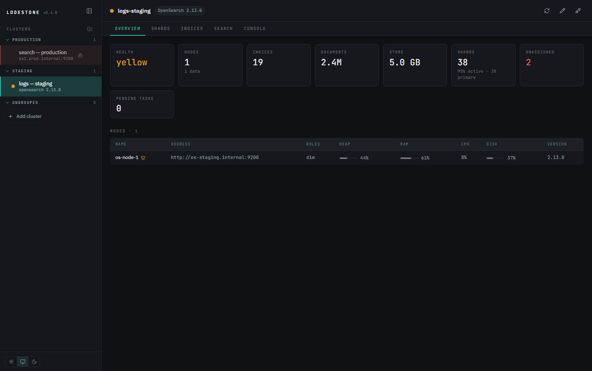
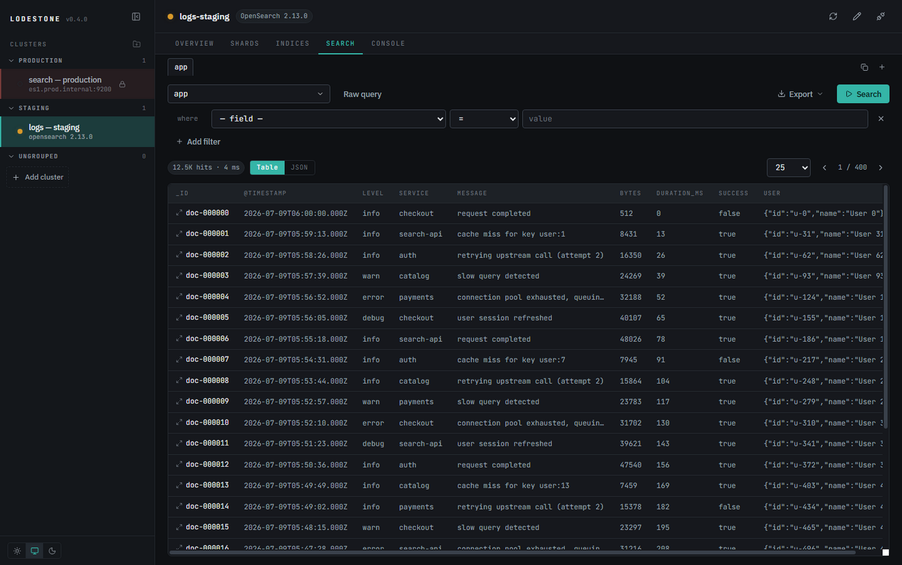
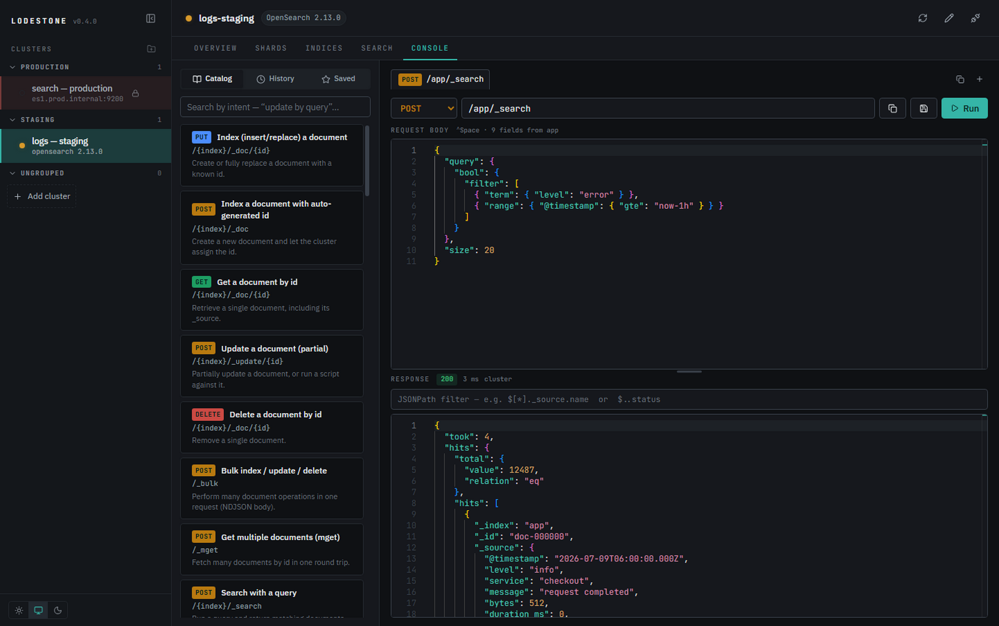
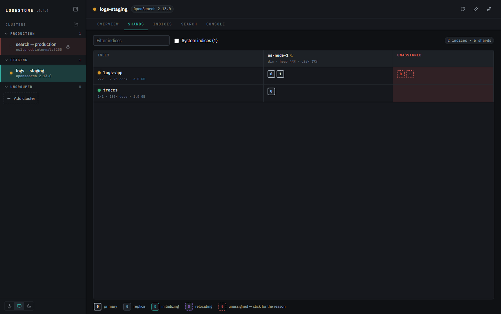

# Lodestone

An open-source desktop GUI for **Elasticsearch** (7.x / 8.x) and **OpenSearch** (1.x / 2.x),
built with Electron. A modern successor to the spirit of `elasticsearch-head` — without its
limits.

> Status: **beta** — multi-cluster management with node discovery and failover, cluster
> overview, shard allocation grid, index management, a data browser with inline document
> editing, a no-JSON aggregation builder, a multi-tab REST console with context-aware
> query-DSL autocomplete, an analyzer playground, relevance debugging (`_explain` / profile
> trees), fixture data generation, Java code generation, and cross-platform installers with
> in-app auto-update. See [REQUIREMENTS.md](REQUIREMENTS.md) for the full spec and roadmap.



| Data browser — filters, table/JSON views, inline editing | REST console — intent catalog, DSL autocomplete, JSONPath response filter |
|---|---|
|  |  |

<details>
<summary>More: shard allocation grid with <code>_allocation/explain</code></summary>



</details>

## Why another ES GUI?

Born from operating real Elasticsearch fleets with the existing tools, and hitting the
same five walls every day:

- **Browser extensions bleed state between tabs.** Head-style extensions share one
  background connection: connect a second tab to Pod B and every other tab silently
  retargets — a query drafted against Pod A fires into Pod B. In Lodestone every cluster
  is an explicit, isolated connection; a request physically cannot cross clusters. Add
  read-only mode (enforced in the main process, not just hidden in the UI) and
  type-to-confirm destructive ops, and production stops being scary.
- **Generic GUIs make you hunt the API docs.** Lodestone ships a searchable-by-intent
  API catalog — type "update by query" and get the endpoint, a documented pre-filled
  body, and a Run button. The console autocompletes paths from your live indices and
  request bodies from the actual Query DSL.
- **Editing one field shouldn't mean hand-writing an `_update` request.** Open any
  search hit and edit it in place — inline in the results table or as JSON — with
  validation and a confirm step. The `_id` plumbing and request wrapping are the tool's
  job, not yours.
- **Fleets are fragmented.** Register any number of clusters from one seed URL each —
  topology is discovered via `_nodes`, requests fail over to healthy nodes, connections
  are grouped in folders, and each workspace keeps its state (secured by the OS
  credential vault; no CORS wall, self-signed TLS supported).
- **Raw Query DSL is written blind.** The query editors are context-aware: they know
  what belongs inside `query`, `bool`, and `aggs`, complete your index's real field
  names, and insert clause templates with tab-stops — no more bracket archaeology
  mid-incident.

## How it compares

The existing tools are good at what they do — several of them inspired Lodestone. Each
pain above is solved *somewhere*; what didn't exist is one tool that covers the whole
daily-ops loop:

| | Kibana / OSD Dev Tools | Cerebro | elasticvue | dockit | **Lodestone** |
|---|---|---|---|---|---|
| Deployment | server per cluster | self-hosted server | browser / desktop | desktop | **desktop** |
| Isolated multi-cluster contexts, one pane | ✗ | ✓ switching | ✓ list | partial | **✓ + folders** |
| Node discovery & failover from one seed | n/a | ✗ | ✗ | ✗ | **✓** |
| ES **and** OpenSearch | ✗ (split stacks) | partial | ✓ | ✓ | **✓ (adapts at connect)** |
| Read-only guard enforced below the UI | ✗ | ✗ | ✗ | ✗ | **✓** |
| Intent-searchable API catalog w/ templates | ✗ | ✗ | ✗ | ✗ | **✓** |
| Context-aware Query-DSL + field autocomplete | ✓ (best-in-class) | ✗ | shallow | ✓ | **✓ + live index fields** |
| Direct document editing (table + JSON) | read-mostly | ✗ | basic | ✗ | **✓ with confirm/validation** |
| Shard allocation grid + `_allocation/explain` | ✗ | ✓ | partial | ✗ | **✓** |
| Entity classes generated from mappings | ✗ | ✗ | ✗ | ✗ | **✓ Java/Spring** |
| Copy request as client code | cURL only | ✗ | ✗ | ✗ | **✓ cURL + 3 Java flavors** |
| Analyzer playground (token comparison) | ✗ | ✗ | ✗ | ✗ | **✓ side-by-side** |
| Relevance debugging (explain / profile trees) | profiler only | ✗ | ✗ | ✗ | **✓ both, per-hit** |
| Fixture data generator | ✗ | ✗ | ✗ | ✗ | **✓** |
| Maintained | ✓ | ~2021 | ✓ | ✓ | ✓ |

If you only need a console against one cluster, Kibana Dev Tools is excellent. If you
want a lightweight all-rounder in the browser, use elasticvue. Lodestone is for people
operating **many** secured clusters who want head's directness with production-grade
guardrails.

## Roadmap

Near-term, in rough order — items that exploit having N live cluster connections in one
app are marked ★ (they're the ones single-cluster tools structurally can't follow):

- ★ **Cross-cluster operations** — reindex between registered clusters, diff
  mappings/settings across environments, "promote index to prod".
- ★ **Dry-run guardrails** — auto `_count` preview before update/delete-by-query:
  *"this touches 48,211 docs in production"* before anything runs.
- **Workspace persistence** — reopen exactly as you left it: tabs, queries, console
  sessions per cluster.
- **Auth breadth** — API keys and **AWS SigV4** (Amazon OpenSearch Service), mTLS.
- **Snapshot & restore** UI, ILM/ISM policy and index-template managers.
- **Task manager** — live `_tasks` with reindex progress and cancel.
- **Bulk import/export** — NDJSON/CSV file → index with mapping preview; full-index
  export via scroll.
- **Best-practices audit** — flag misconfigurations and governance issues per
  cluster/index: zero-replica indices, oversharding, disk-watermark risk,
  mapping explosion, deprecated settings.

Windows, macOS, and Linux installers are already built via CI on every `v*` tag, with
in-app auto-update.

## Features so far

- **Clusters** — register any number, each from one or more seed nodes; discovery +
  failover. Organize connections into named folders with drag-and-drop, or collapse the
  sidebar to an icon strip with per-cluster status LEDs. Clone existing connections.
- **Overview** — health, node table with heap/RAM/CPU/disk meters and elected-master marker.
- **Shards** — indices × nodes allocation grid with primary/replica/relocating/initializing
  states; click an unassigned shard for a `_cluster/allocation/explain` breakdown.
- **Indices** — list, create (settings + mappings), edit dynamic settings, view mappings,
  manage aliases, refresh/flush/force-merge/open/close, delete (type-to-confirm).
- **Search** — index/alias picker, mapping-driven filter builder that compiles to a `bool`
  query, raw JSON mode (Monaco) with context-aware query-DSL autocomplete (query types,
  aggregations, field names, and enum values suggested based on cursor position),
  sortable paged results, inline document editing with validation and confirm-before-
  overwrite, document delete, export to JSON / NDJSON / CSV.
- **Aggregations** — a no-JSON aggregation builder with **nested** groupings: chain
  bucket aggregations (terms, date/numeric histogram, ranges, significant terms,
  missing) — "group by service, then by day" — with metrics (avg, sum, min/max, unique
  count, value count, stats, percentiles) computed at the innermost bucket. Nested
  results flatten into one row per leaf bucket, one column per level. An optional
  structured filter (the same builder as Search) scopes the whole thing, field
  dropdowns are filtered to compatible types (text aggregates via `.keyword`
  automatically), and you can view the raw JSON at any point.
- **SQL** — query with SQL, built visually: SELECT / WHERE / GROUP BY / ORDER BY
  dropdowns compile to native `_search` requests (works on any ES/OpenSearch version,
  no SQL plugin required — a "DSL" button shows the compiled request). **JOINs
  included**: Lodestone executes them itself as bounded searches — capped left side,
  batched `terms` lookups, hard output limit — so the cluster never runs a join and
  a heavy query can't hurt it. Raw SQL mode passes through to `_sql` /
  `_plugins/_sql` for server-side execution.
- **Console** — a Dev-Tools-style REST console with multiple parallel request tabs,
  backed by a searchable API catalog: find an operation by intent ("update by query",
  "reindex") and get a documented, pre-filled template. Path autocomplete from the
  catalog and live index names, field-aware body autocomplete, request history and
  saved requests (per cluster), a response pane with status/timing, and copy-as-cURL.
- **Analyze** — a side-by-side analyzer playground: run any analyzer or mapped field
  against sample text and compare the two token streams (offsets, positions) — the
  fastest answer to "why doesn't this match?".
- **Relevance & performance debugging** — one-click `_explain` for any search hit
  rendered as a readable scoring tree; the console response pane renders
  `"profile": true` output as a query-execution tree with timings.
- **Code generation** — generate a Spring Data Elasticsearch entity (`@Document`
  POJO with typed `@Field`s and nested classes) from any index mapping; copy any
  console request as cURL or Java (low-level RestClient, Spring Data `StringQuery`,
  official API client). TypeScript and Python generators are on the roadmap.
- **Fixtures** — generate plausible, seeded test documents inferred from a mapping's
  field types and names, and bulk-load them into a dev index — no more testing
  against shared staging.
- **Auto-update** — installed apps check GitHub releases and update in place.
- **Themes** — light, dark, and follow-system theme switching from the sidebar.
- **Guardrails** — per-cluster read-only mode enforced in the main process; destructive
  actions require confirmation.

## Development

```bash
npm install
npm run dev        # launch the app with hot reload
npm run typecheck  # strict TS across main + renderer
npm run build      # production bundles
```

Renderer-only UI preview in a plain browser (mock data, no cluster access):

```bash
npm run dev -- --rendererOnly
```

> Behind a TLS-inspecting corporate proxy, the Electron binary download may fail with
> `UNABLE_TO_GET_ISSUER_CERT_LOCALLY`. Fix: `NODE_OPTIONS=--use-system-ca npm install`.

## Building installers

```bash
npm run make-icons   # regenerate icons from build/icon.svg (uses the Electron binary)
npm run dist:win     # Windows: NSIS installer + zip  -> dist/
npm run dist:mac     # macOS: dmg + zip (x64 + arm64) -> dist/
npm run pack:dir     # unpacked app for quick local testing (no installer)
```

Builds are unsigned by default; supply electron-builder's standard signing env
vars to sign and (on macOS) notarize. See [CONTRIBUTING.md](CONTRIBUTING.md).

**Platform notes**

- macOS packaging must run on macOS (dmg uses `hdiutil`). CI covers this: the
  [release workflow](.github/workflows/release.yml) builds Windows, macOS
  (Intel + Apple Silicon) and Linux on every `v*` tag, and can be run manually
  from the Actions tab.
- Opening an **unsigned** macOS build: Gatekeeper will block the first launch —
  right-click the app → Open (or clear the quarantine flag with
  `xattr -cr /Applications/Lodestone.app`).
- Unsigned Windows builds trigger SmartScreen — “More info → Run anyway”.

## Architecture

- **Main process** owns all cluster traffic: a version-adaptive HTTP transport
  ([src/main/transport.ts](src/main/transport.ts)) with node discovery and failover,
  connection storage with `safeStorage`-encrypted secrets, and the read-only guard.
- **Renderer** (React + TypeScript) talks to it only through a typed IPC bridge
  (`contextIsolation` on, no node integration).

## License

[Apache 2.0](LICENSE)
